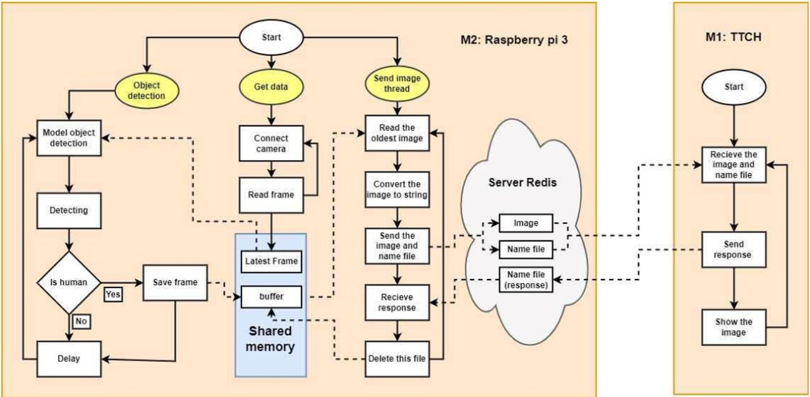

# Object detection on Raspberry Pi 3 with Model TFlite

<div align="center">
  <a href="https://ultralytics.com/yolov8" target="_blank">
  </a>
</div>


Project thực hiện phát hiện nạn nhân từ UAV gắn máy tính nhúng Raspberry Pi 3 và Camera. Pi 3 thực hiện chạy ba luồng chính:

(1) Luồng lấy dữ liệu từ camera: Frame mới nhất được lưu trữ trong biến LFrame. 

(2) Luồng xử lý dữ liệu: LFrame làm đầu vào model. Model thực hiện xử lý nếu phát hiện ra nạn nhân thì lưu trữ frame đó vào vùng nhớ chung buffer

(3) Luồng gửi dữ liệu: Truy cập vào buffer. Nếu có dữ liệu thì thực hiện gửi về server qua Redis Server. Sau khi nhận được phản hồi từ server thì xoá frame đó trong buffer


## Requirements

### Raspberry Pi 3
* python==3.7.3
* numpy==1.21.6
* opencv-contrib-python==4.4.0.46 
* opencv-python==4.5.1.48
* redis==4.5.5
* tflite-runtime==2.5.0.post1

### Server(windows 10)
* python==3.11.4
* redis==5.0.1
* opencv-python==4.8.1.78
* numpy==1.26.2

## Getting started
(1) Config ip Raspberry Pi 3 trên server (C:\Program Files\Redis\redis.windows.conf) và trên Pi 3 (/ect/redis/redis.conf)

(2) Reset Redis server trên Pi 3
```bash
sudo systemctl restart redis
```

(3) Chạy chương trình trên Pi 3:
```bash
python object_detect_on_pi.py
```
** Lựa chọn model tflite của mobilenet v2 hoặc yolo v5 bằng cách thay đổi
```bash
#imageDetect, isHuman = tflite_detect_images_mobilenet(PATH_TO_MODEL_MOBILENET, LFRAME, PATH_TO_LABELS_MOBILENET, min_conf_threshold_MOBILENET)
imageDetect, isHuman = tflite_detect_images_yolo(PATH_TO_MODEL_YOLO, LFRAME, PATH_TO_LABELS_YOLO, min_conf_threshold_YOLO)
```

(4) Chạy chương trình trên server: để nhận dữ liệu từ Pi 3 truyền về
```bash
python recv_redis.py
```
